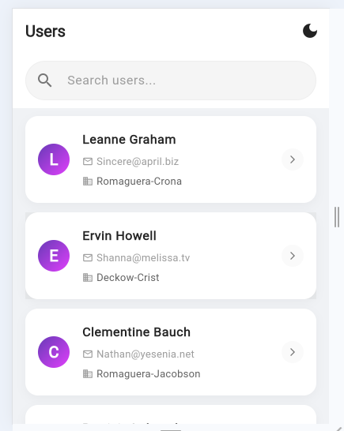
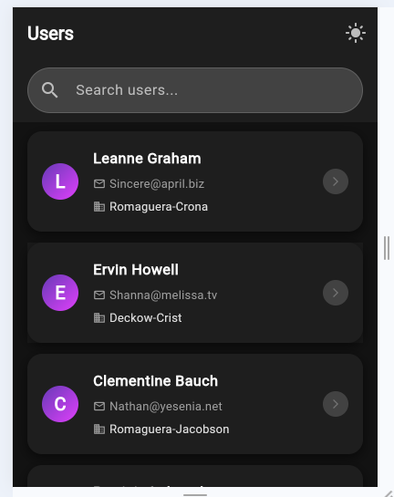
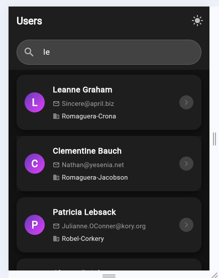
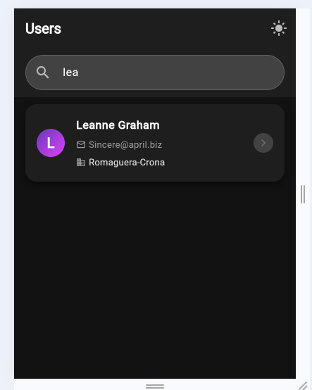
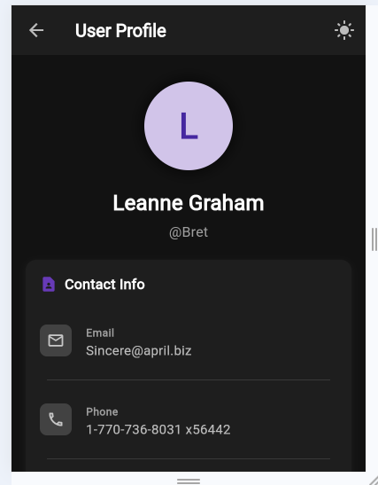
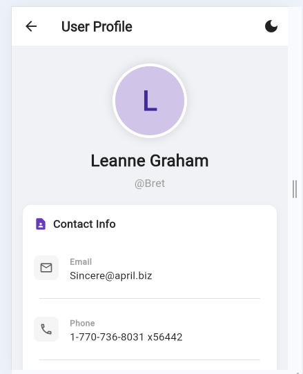
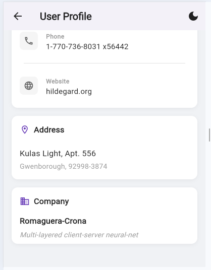

✨ Features

🌗 Dark Mode & Light Mode Support
Seamlessly switch between dark and light themes for better user experience.

🔍 Search User by Three Digits
Quickly locate users using a three-digit search input.

🔢 Search User by Two Digits
Supports flexible search using two-digit identifiers.

👤 User Profile View
View detailed user profile information in a clean layout.

🎨 Consistent UI Across Themes
Uniform design and layout maintained across dark and light modes.

📱 Mobile-Friendly Interface
Responsive design optimized for mobile devices.

🖼️ Screenshots Overview

The paths have been updated to reflect the structure: `screenshots/filename.PNG`.

| Screenshot | File Name | Image | Description |
| :--- | :--- | :--- | :--- |
| **Light Mode View** | `lightMood.PNG` |  | Application interface displayed in light mode. |
| **Dark Mode View** | `darkMood.PNG` |  | Application interface displayed in dark mode. |
| **Search User (Two Digits)** | `searchUserByTwoDigit.PNG` |  | User search functionality using two-digit input. |
| **Search User (Three Digits)** | `searchUserByThreeDigit.PNG` |  | User search functionality using three-digit input |
| **User Profile (Dark Mode)** | `userProfileDarkMood.PNG` |  | User profile screen displayed in dark mode. |
| **User Profile (Light Mode)** | `userProfileLightMood.PNG` |  | User profile screen displayed in light mode |
| **User Profile (Light Mode – Variant)** | `userProfileLight2.PNG` |  | Another light mode layout for the user profile screen. |